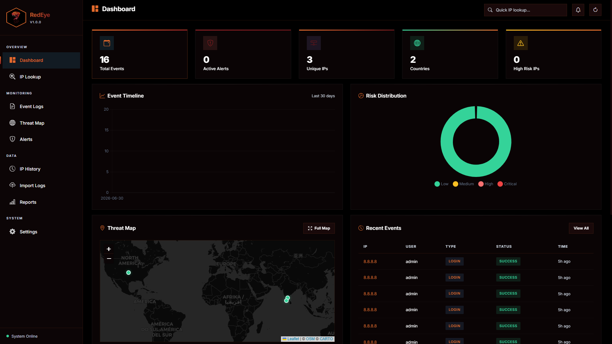
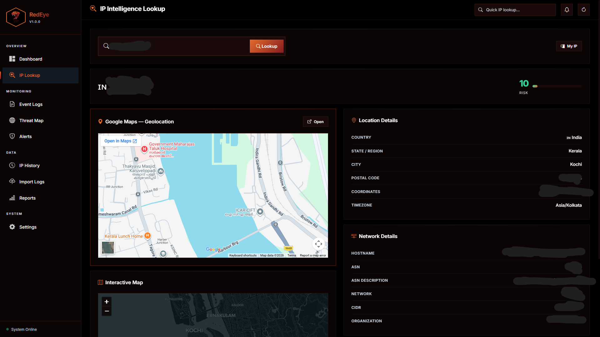
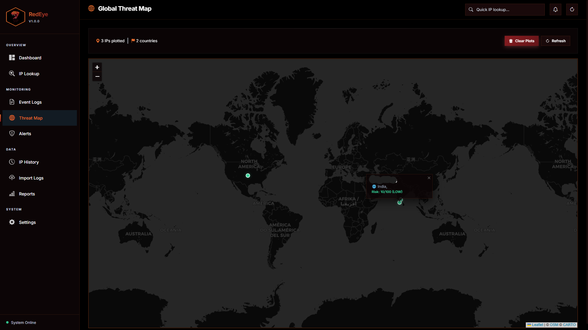
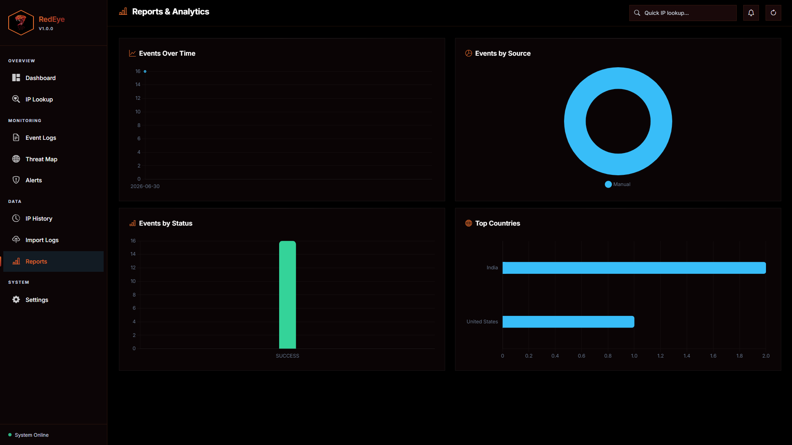

<p align="center">
  
</p>

# 🐍 RedEye — IP Intelligence Platform

RedEye (formerly SentinelSOC) is a production-quality, internal Security Operations Center (SOC) platform designed for security teams to monitor login activity, investigate IP addresses, calculate risk scores, visualize global threat footprints, and detect malicious/anomalous activities in real-time.

---

## 🖼️ Application Screenshots

### 📊 Dashboard & Metrics
<p align="center">
  
</p>

### 🔍 IP Geolocation & Intelligence Lookup
<p align="center">
  
</p>

### 🗺️ Global Threat Map
<p align="center">
  
</p>


### 📈 Reports & Analytics
<p align="center">
  
</p>

---

## 🌟 Key Features

*   **Unified Intelligence Engine**: Stand-alone or batch lookup orchestrating:
    *   **GeoIP2 Geolocation**: Accurate location extraction (country, region, city, coordinates, timezone) from MaxMind binary DBs.
    *   **RDAP/WHOIS Queries**: Direct network registry parsing (ASN, CIDR, registrar, organization, abuse contacts) via `ipwhois`.
    *   **Reverse DNS Resolver**: Automatic PTR mapping via standard network sockets.
    *   **VPN/Proxy Checker**: Real-time identification of hosting provider spaces, cloud instances, and commercial proxies.
    *   **TOR Node Detector**: Automatically downloads and caches live exit node lists directly from the Tor Project.
*   **Modular Threat Scoring**: Evaluates Composite Risk levels (0-100) mapped to severity classifications (`LOW`, `MEDIUM`, `HIGH`, `CRITICAL`).
*   **Modular Detection Engine**: Alerts generated automatically for:
    *   TOR Exit Node Activity
    *   VPN/Proxy/Anonymizer logins
    *   Datacenter/Hosting provider logins
    *   Brute-force thresholds (multiple failed logins from same IP)
    *   Credential stuffing (multiple failed logins on same user name)
    *   Impossible Travel speeds (successful logins from different locations at physically impossible speeds)
    *   New Country Logins per user account
*   **Bulk IP List Ingestion**: Designed for security analysts to bulk-check large lists of IP addresses. Upload a plain text file containing IP addresses line-by-line to automatically run intelligence lookups and plot threat locations on the global map instantly.
*   **Premium Dark UI Dashboard**:
    *   **KPI stats**: Animated counters representing events, alerts, tracked IPs, and countries.
    *   **Visual Analytics**: Timeline charts, risk distribution donut graphs, and country frequency bar graphs powered by `Chart.js`.
    *   **Dual-Map Integration**: IP Lookup rendering an embedded **Google Maps** frame combined with an interactive **Leaflet.js** map.
    *   **Global Threat Map**: Heat-mapping coordinates, clustering markers, and popup details.

---

## 🛠️ Tech Stack

*   **Backend**: Python 3.12, Flask, Flask Blueprints, Flask RESTX
*   **Database**: SQLite, Flask-SQLAlchemy (ORM), Flask-Migrate (Alembic migrations)
*   **Frontend**: Vanilla HTML5/CSS3 (Premium custom design system with Glassmorphism), JavaScript (ES6 Modules)
*   **Libraries**: Chart.js (v4), Leaflet.js (v1.9), MaxMind GeoIP2, ipwhois, dnspython

---

## 🚀 Setup & Installation

### 1. Prerequisites
Ensure you have **Python 3.12+** installed on your system.

### 2. Clone the Repository
```bash
git clone https://github.com/jissjames322/RedEye.git
cd RedEye
```

### 3. Create and Activate Virtual Environment
```bash
# Windows
python -m venv venv
.\venv\Scripts\activate

# Linux / macOS
python3 -m venv venv
source venv/bin/activate
```

### 4. Install Dependencies
```bash
pip install -r requirements.txt
```

### 5. Environment Settings
Create a `.env` file in the root directory:
```env
SECRET_KEY=change_this_to_a_long_random_secret
DATABASE_URL=sqlite:///sentinel.db
GEOIP_DB=database/GeoLite2-City.mmdb
UPLOAD_FOLDER=uploads
LOG_FOLDER=logs
```

### 6. Apply Database Migrations
Create the tables and schema:
```bash
flask db upgrade
```

### 7. Run the Application
Start the development server:
```bash
python run.py
```
Open your browser and navigate to `http://127.0.0.1:5000`.

---

## 📁 Folder Structure

```
app/
├── blueprints/        # Route controllers (main.py, api.py)
├── models/            # Database schemas (ip_address.py, security_event.py, etc.)
├── repositories/      # SQL database operations (ip_repository.py, etc.)
├── services/          # Business logic pipeline & alert engine
├── intelligence/      # Geolocation, DNS, RDAP, VPN, TOR detectors
├── parsers/           # Log format decoders (Apache, SSH, MIS, Generic)
├── templates/         # HTML structure views
└── static/            # Static assets (css/style.css, js/main.js)
database/              # MaxMind mmdb file location
logs/                  # Output log files (sentinel.log)
uploads/               # Temporary uploads storage
tests/                 # Ingestion test suites
config.py              # Application settings
run.py                 # Startup file
```

---

## 📈 REST API Endpoints

*   `GET /api/health` — Check system status
*   `GET /api/dashboard` — Returns summary counts, timeline charts, and maps data
*   `GET /api/events` — Returns paginated security log events with filters
*   `GET /api/ip/<ip>` — Fetch database profile for targeted IP
*   `POST /api/ip/lookup` — Perform standalone IP intelligence scan
*   `GET /api/ip/history` — List of all cached IP logs
*   `POST /api/import` — Upload and ingest server logs
*   `GET /api/alerts` — Fetch security alerts and counts
*   `PUT /api/alerts/<int:id>/resolve` — Mark alert status as resolved
*   `GET /api/map/data` — Retrieve coordinate plot datasets
